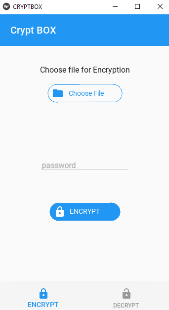

# Crypt-Box
Crypt Box - Python -KivyMD beginners Project
This is Python Beginners Project made with #KivyMD

I'm started Python and I want to build a Mini GUI Project with Kivy and discovered KivyMD. KivyMD gives you Material Design with Python. 

This is Encryption and decryption App made with  Python and kivyMD

[FOR Beginners] : Practice OOP , kivy and kv language [It's kivy designing language] 

Required :

You install these with `pip install`

* kivy  
* kivyMD
* plyer [I used it for opening files with Windows explorer you can with kivy also]
* pyAesCrypt [For Encrypting and Decrypting files]

I'm a beginner and this is my first Python project so the code is :p
